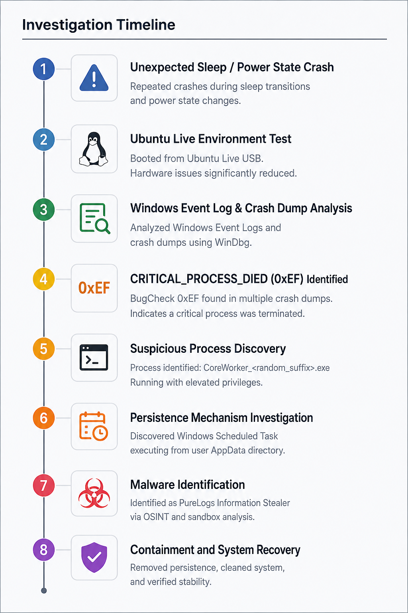
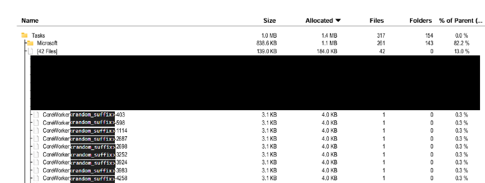
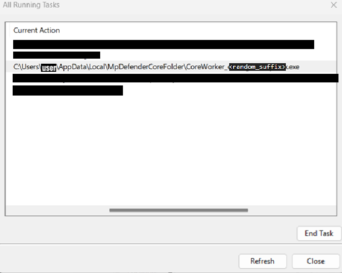
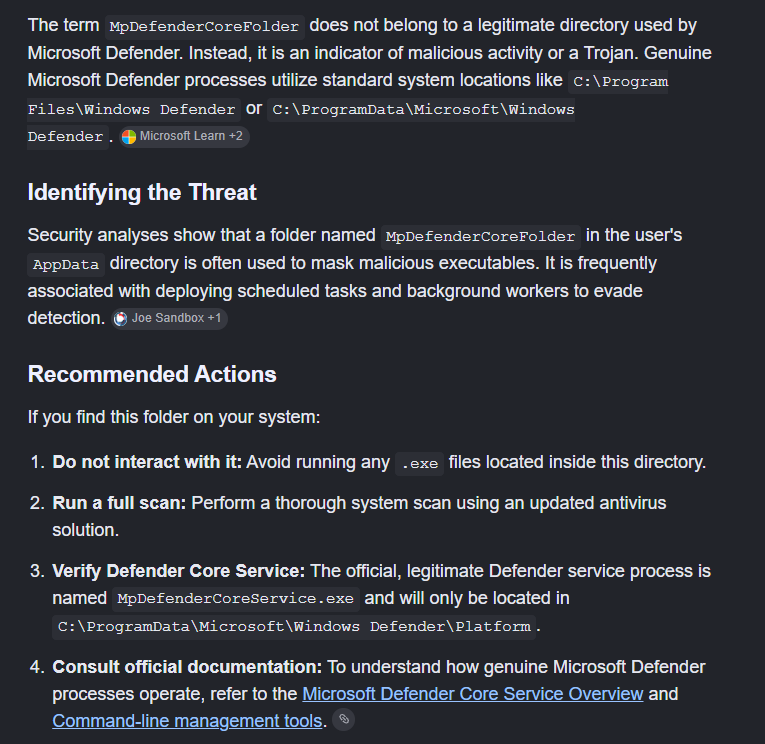

# Operation SilentCookie

> A Windows DFIR investigation that started with an unexplained
> CRITICAL_PROCESS_DIED crash and revealed a malware persistence mechanism
> used by an information-stealing trojan.


## Table of Contents

- [Overview](#overview)
- [Key Findings](#key-findings)
- [Investigation Timeline](#investigation-timeline)
- [Investigation Environment](#investigation-environment)
- [Tools Used](#tools-used)
- [Repository Structure](#repository-structure)

- [Incident Investigation Phase](#incident-investigation-phase)
  - [Initial Crash Investigation](#initial-crash-investigation)
  - [Crash Dump Analysis](#crash-dump-analysis)
  - [Suspicious Process Discovery](#suspicious-process-discovery)
  - [Kernel Stack Analysis](#kernel-stack-analysis)
  - [Locating the Executable](#locating-the-executable)
  - [Scheduled Task Investigation](#scheduled-task-investigation)
  - [Executable Location](#executable-location)
  - [Open Source Intelligence (OSINT)](#open-source-intelligence-osint)
  - [Persistence Mechanism](#persistence-mechanism)
  - [Triggering the Crash](#triggering-the-crash)
  - [Task XML Analysis](#task-xml-analysis)
  - [Digital Signature Verification](#digital-signature-verification)

- [Remediation Phase](#remediation-phase)
  - [Persistence Survived Task Removal](#persistence-survived-task-removal)
  - [New Hypothesis](#new-hypothesis)
  - [Safe Mode Strategy](#safe-mode-strategy)
  - [Removing the Persistence](#removing-the-persistence)
  - [Verification](#verification)
  - [Post-Incident Cleanup](#post-incident-cleanup)

- [Malware Research Phase](#malware-research-phase)
  - [Malware Identification](#malware-identification)
  - [Malware Analysis](#malware-analysis)

- [Final Documentation](#final-documentation)
  - [Prevention Recommendations](#prevention-recommendations)
  - [Lessons Learned](#lessons-learned)
  - [References](#references)
  - [Future Work](#future-work)
  - [Disclaimer](#disclaimer)
  - [Author](#author)

---


## Overview

Operation SilentCookie is a Digital Forensics and Incident Response (DFIR)
investigation focused on identifying the cause of repeated Windows 11 crashes
during sleep transitions and power state changes.

The incident initially appeared to be related to hardware, drivers, or Windows
stability issues. After forensic analysis, the root cause was identified as a
malicious executable using Windows persistence mechanisms and abusing critical
process behavior.

This investigation documents the complete response lifecycle, including
root-cause identification, malware analysis, containment, and system recovery.


## Key Findings

| Finding | Result |
|---|---|
| Incident Type | Malware-assisted system crash |
| Crash Cause | CRITICAL_PROCESS_DIED (0xEF) |
| Suspicious Process | `CoreWorker_<random_suffix>.exe` |
| Persistence Method | Windows Scheduled Task |
| Execution Location | User AppData Directory |
| Digital Signature | Not Signed |
| Malware Classification | PureLogs Information Stealer |
| Primary Target | Browser credentials and cookies |
| Incident Status | Resolved |


## Investigation Timeline

The investigation progressed through the following major stages.




## Investigation Environment

| Component         | Value              |
| ----------------- | ------------------ |
| Operating System  | Windows 11         |
| Device            | ASUS ROG G614JV    |
| Firmware          | UEFI               |
| Architecture      | x64                |
| File System       | NTFS               |
| Security Software | Microsoft Defender |

## Tools Used

### Windows Analysis

- WinDbg
- Windows Event Viewer
- PowerShell
- Task Scheduler
- Registry Editor


### Malware Analysis

- Joe Sandbox
- Malwarebytes


### Supporting Tools

- TreeSize Free
- Ubuntu Live USB
- ElevenForum


## Repository Structure

```
Operation-SilentCookie/
│
├── README.md
├── LICENSE
├── .gitignore
│
├── malware/
│   └── malware-analysis.md
│
└── evidence/
    ├── images/
    │   ├── investigation/
    │   └── malware/
    │
    └── artifacts/
        ├── investigation/
        └── malware/
```

- **README.md** – Main DFIR investigation report.
- **malware/** – Technical analysis of the identified PureLogs malware.
- **evidence/** – Sanitized screenshots and forensic artifacts collected during the investigation.

---

## Incident Investigation Phase

The following sections document the investigation from the initial system crash
to the discovery of the malware persistence mechanism.

### Initial Crash Investigation

The investigation began after repeated system crashes occurred during sleep
transitions and AC power state changes.

Before analyzing Windows artifacts, the possibility of a hardware failure was
evaluated by booting the system from an Ubuntu 26.04 LTS Live environment.

The system remained stable under Linux:

- No unexpected restarts
- No crashes during Sleep
- No crashes during AC power transitions

This significantly reduced the likelihood of a hardware problem and shifted the
focus of the investigation toward the Windows software environment.

The next step was to analyze Windows crash reports, Event Viewer logs, and
kernel crash dumps to identify the component responsible for the failures.


### Crash Dump Analysis

Using WinDbg, multiple kernel crash dumps were analyzed.

Although individual dumps contained minor differences, one indicator appeared
consistently:

```text
BugCheck 0xEF
CRITICAL_PROCESS_DIED
```

This bugcheck indicates that Windows detected the unexpected termination of a
process registered as critical.

Across multiple dumps, the same process repeatedly appeared:

```
PROCESS_NAME:
CoreWorker_<random_suffix>.exe
```

Some crash dumps displayed only a shortened process name:

```
CoreWorker_eIS
```

This recurring pattern became the primary focus of the investigation.


### Suspicious Process Discovery

At this stage, the identity of the process was unknown.

Several characteristics immediately appeared unusual:

- Executed automatically during startup
- Running with elevated privileges
- Treated by Windows as a critical process
- Triggered a system crash when terminated

Legitimate Windows critical processes normally include components such as:

- csrss.exe
- wininit.exe
- services.exe
- smss.exe

No standard Windows installation contains a process following the pattern:

```text
CoreWorker_<random_suffix>.exe
```

The generic process name combined with a randomized suffix strongly suggested
that additional investigation was required.


### Kernel Stack Analysis

The crash stack provided additional information about the termination sequence.

The relevant execution path was:

```text

nt!NtTerminateProcess
|
nt!PspTerminateProcess
|
nt!PspCatchCriticalBreak
|
nt!KeBugCheckEx

```


Interpretation:

1. `NtTerminateProcess`

   The process termination request was initiated.

2. `PspTerminateProcess`

   The Windows kernel started terminating the process.

3. `PspCatchCriticalBreak`

   The kernel detected that the terminated process was marked as critical.

4. `KeBugCheckEx`

   Windows triggered a system crash with:

```

CRITICAL_PROCESS_DIED (0xEF)

```


At this point, the investigation objective became clear:

- Identify the origin of the executable.
- Determine why Windows treated it as a critical process.
- Identify the persistence mechanism responsible for launching it.


### Locating the Executable

The next objective was locating the executable on disk.

TreeSize Free was used to search the system drive for files matching the
keyword:

```text
CoreWorker
```

Although TreeSize is not a forensic tool, it provided a fast method for locating
referenced files across the system.

The search immediately revealed a Task Scheduler definition associated with the
suspicious process.



This discovery suggested that the executable was being launched through a
scheduled task, indicating the presence of a persistence mechanism.

The investigation therefore shifted toward analyzing Windows Task Scheduler.


### Scheduled Task Investigation

The discovered file was not the executable itself.

Instead, it was an task used by Windows Task Scheduler.

Its purpose was to instruct Windows to automatically launch the executable
under specific trigger conditions.

To better understand its behavior, Task Scheduler was opened and all scheduled
tasks were inspected.

Several tasks sharing the following naming pattern were discovered:

```
CoreWorker_<random_string>
```

Only one instance was actively running while the remaining tasks were waiting
for their configured triggers.




### Executable Location

Inspecting the task properties revealed the executable path.

Instead of pointing to a Windows system directory, the task launched a binary
located under:

```
%LOCALAPPDATA%\MpDefenderCoreFolder\
```

The location immediately appeared suspicious.

Legitimate Windows critical components are normally stored inside protected
directories such as:

- C:\Windows\
- C:\Program Files\
- C:\Program Files (x86)

Running a process that later behaves as a critical Windows component directly
from a user profile directory is highly unusual.


### Open Source Intelligence (OSINT)

The folder name was searched across multiple public sources.

Multiple reports associated this directory with malware campaigns and browser
credential stealers.




### Persistence Mechanism

Analysis of the scheduled task showed that the malware established persistence
using Windows Task Scheduler.

The task was responsible for automatically launching the executable after
specific system events.

This explains why the process consistently reappeared after every reboot.


### Triggering the Crash

To verify the relationship between the task and the observed crashes, the
running process was manually terminated.

Immediately after terminating the process:

- the display went black,
- Windows crashed,
- the system automatically rebooted.

This behavior perfectly matched the symptoms originally observed during Sleep
transitions and AC power state changes.

The experiment strongly suggested that Windows considered the process
"critical", causing BugCheck 0xEF whenever it terminated.


### Task XML Analysis

The complete Task Scheduler XML definition was exported for analysis.

Only relevant excerpts are shown below.

#### Execution Privilege

```xml
<Principal id="Author">
    <LogonType>InteractiveToken</LogonType>
    <RunLevel>HighestAvailable</RunLevel>
</Principal>
```

This configuration allowed the task to execute with the highest privileges
available for the current user.

#### Executable Path

```xml
<Actions Context="Author">
    <Exec>
        <Command>%LOCALAPPDATA%\MpDefenderCoreFolder\CoreWorker_<random_suffix>.exe</Command>
    </Exec>
</Actions>
```

The task launched an executable from a user-writable AppData directory rather
than a protected Windows system location.

#### Execution Trigger

```xml
<Triggers>
    <LogonTrigger>
        <Enabled>true</Enabled>
    </LogonTrigger>
</Triggers>
```

The task was configured to automatically execute when the user logged in,
providing persistence across system restarts.

The full sanitized XML artifact is available here:

[View sanitized Task Scheduler XML](evidence/artifacts/investigation/01-coreworker-task.xml)


### Digital Signature Verification

The executable was then verified using PowerShell Authenticode signature validation.

```powershell
Get-AuthenticodeSignature <file>
```

The result was:

```
Status : NotSigned
```

This alone does **not** prove malware.

However, combined with other indicators:

execution from a user-writable AppData directory,
persistence through Windows Scheduled Tasks,
randomized naming pattern,
abnormal critical process crash behavior,

the collected evidence strongly indicated that the executable was malicious.

---

## Remediation Phase


### Persistence Survived Task Removal

The first remediation attempt was straightforward: remove the scheduled task.

The task was deleted successfully, and the system was rebooted.

However, the problem immediately returned.

After Windows started again:

- The scheduled task had been recreated.
- The `CoreWorker` process was running again.
- The system still crashed during Sleep transitions and AC power changes.

This demonstrated that deleting the scheduled task alone was not sufficient to
eliminate the persistence mechanism.


### New Hypothesis

At this stage, a new hypothesis was formed.

Some other persistence mechanism appeared to be monitoring the system and
recreating the scheduled task whenever it was removed.

Possible persistence mechanisms included:

- Registry Run keys
- Windows Services
- WMI Event Subscriptions
- Startup entries
- A secondary loader or dropper

The exact mechanism responsible for recreating the task had not yet been
identified.


### Safe Mode Strategy

Because the suspicious process was active during normal Windows operation,
attempting to remove it while the operating system was fully loaded caused
system instability.

To prevent the malware from executing during startup, Windows was booted into
Safe Mode.

Safe Mode loads only essential Windows components, preventing many third-party
processes and persistence mechanisms from starting automatically.

This provided a controlled environment for removing the remaining artifacts.


### Removing the Persistence

While running in Safe Mode, the following actions were performed:

- Deleted the entire `MpDefenderCoreFolder` directory located under:

```
%LOCALAPPDATA%
```

- Removed the malicious scheduled task.

- Inspected Windows startup registry locations, including:

```
HKCU\Software\Microsoft\Windows\CurrentVersion\Run

HKLM\Software\Microsoft\Windows\CurrentVersion\Run
```

An additional registry entry associated with the malware was discovered and
removed.

After completing these steps, Windows was configured to boot normally again.


### Verification

Following the cleanup procedure, the system was restarted several times.

The results were consistent:

- The scheduled task was no longer recreated.
- The `CoreWorker` process did not return.
- The `MpDefenderCoreFolder` directory remained absent.
- Sleep mode functioned normally.
- AC power transitions no longer caused crashes.
- No additional `CRITICAL_PROCESS_DIED (0xEF)` events were observed.

These observations strongly suggested that the persistence mechanism had been
successfully removed.


### Post-Incident Cleanup

To ensure that no additional malicious components remained on the system,
several verification and cleanup procedures were performed.

#### Malware Scanning

The system was scanned using multiple independent security tools, including:

- Malwarebytes
- Kaspersky Virus Removal Tool (KVRT)

No additional active threats were detected.

#### Startup Inspection

Startup applications and scheduled startup locations were manually reviewed to
verify that no suspicious entries remained.

#### Temporary File Cleanup

Temporary directories were cleared to remove any remaining temporary artifacts
that may have been created by the malware.

#### Windows Integrity Verification

Finally, Windows system integrity was verified using the built-in repair tools.

```cmd
sfc /scannow
```

followed by:

```cmd
DISM /Online /Cleanup-Image /RestoreHealth
```

Both commands completed successfully, indicating that Windows system files had
not been left in a corrupted state after the incident.


---

## Malware Research Phase

At this point, the immediate incident had been contained.

However, one critical question still remained unanswered:

> **What exactly was this executable, and which malware family did it belong to?**

The next phase of the investigation focused on identifying the sample through
malware intelligence sources, static analysis, behavioral analysis, and
additional forensic artifacts in order to determine its origin and capabilities.


### Malware Identification

With the system stabilized, the investigation shifted from incident response to
malware identification.

Using the collected indicators—including the executable name, persistence
mechanisms, file paths, and behavioral characteristics—I searched public malware
analysis databases for similar samples.

One of the most relevant findings was the following public sandbox report:

**Primary Intelligence Source**

[Joe Sandbox Report - Analysis ID 1891885](https://www.joesandbox.com/analysis/1891885/0/html)

The observed behavior closely matched the artifacts discovered during this
investigation.

According to the sandbox analysis, the malware belongs to the **PureLogs**
information stealer family and primarily targets sensitive information stored by
web browsers.

Its objectives include stealing:

- Google Chrome saved passwords
- Google Chrome cookies
- Microsoft Edge saved passwords
- Microsoft Edge cookies
- Mozilla Firefox credentials
- Mozilla Firefox cookies
- Browser autofill data
- Other locally stored authentication artifacts and user information


### Malware Analysis

This repository intentionally separates the incident response process from the
technical malware analysis.

For a deeper technical analysis of the malware sample, including behavior,
capabilities, and additional artifacts, see:

[PureLogs Malware Analysis](malware/malware-analysis.md)

The malware analysis document is an ongoing research effort and will be
expanded over time as additional artifacts, behavioral observations, and
technical findings are collected.

Keeping these topics separate allows the incident timeline to remain focused
while providing a dedicated technical document for malware research,
reverse engineering, and threat analysis.

---

## Final Documentation

### Prevention Recommendations

This incident highlighted several defensive practices that can significantly
reduce the risk of similar infections.

Recommended security practices include:

- Keep Windows and device firmware fully updated.
- Download software only from trusted and official sources.
- Enable Microsoft Defender Tamper Protection.
- Use a reputable antivirus solution with real-time protection.
- Avoid running unknown executables with administrative privileges.
- Regularly inspect Scheduled Tasks and Startup entries.
- Verify digital signatures of unknown executables.
- Enable Multi-Factor Authentication (MFA) whenever possible.
- Store important data in encrypted backups.
- Monitor browser credential storage and periodically clear unnecessary saved passwords.
- Use a password manager instead of storing passwords directly inside browsers.
- Keep offline backups of important files.
- Periodically review Windows Event Viewer for unexpected critical events.


### Lessons Learned

This investigation reinforced several important technical lessons.

- Never assume repeated system crashes are caused by hardware failure.
- A Linux Live environment is an effective method for distinguishing hardware issues from operating system problems.
- Crash dump analysis often provides the first meaningful forensic evidence.
- Windows Scheduled Tasks are a common persistence mechanism used by information-stealing malware.
- Processes executing from user profile directories deserve immediate attention during incident response.
- A missing digital signature alone does not prove malware, but when combined with persistence, suspicious execution paths, and abnormal system behavior, it becomes a strong indicator.
- Combining Event Viewer, WinDbg, PowerShell, Task Scheduler analysis, OSINT, and public sandbox reports produces significantly better results than relying on a single investigative tool.


### References

The following resources significantly contributed to this investigation:

- Microsoft Learn
- WinDbg Documentation
- Joe Sandbox
- Malwarebytes Threat Intelligence
- Broadcom Threat Research
- ElevenForum Community

Related community investigation:

[ElevenForum: Repeated CRITICAL_PROCESS_DIED (0xEF) during Idle / AC unplug](https://www.elevenforum.com/t/repeated-critical_process_died-0xef-only-during-idle-ac-unplug-asus-rog-g614jv-coreworker_eis.47963/)

Special thanks to the ElevenForum community members who helped analyze the crash dumps and provided valuable troubleshooting suggestions throughout the investigation.


### Future Work

Future improvements may include:

- More detailed malware analysis
- Additional artifact collection
- Detection methods for similar threats
- Further investigation of malware behavior


### Disclaimer

This repository is intended exclusively for educational, research, digital
forensics, and defensive cybersecurity purposes.

No malware samples, stolen credentials, personal information, or unsafe content
are distributed through this repository.

All screenshots, logs, crash dumps, registry exports, scheduled task
definitions, and forensic artifacts have been reviewed and sanitized before
publication.


### Author

**Aryan Ghasemi**

Computer Science Student

Areas of Interest:

- Incident Response
- Digital Forensics
- Malware Analysis
- Threat Hunting
- Defensive Security
- Backend Engineering

If this investigation helps you solve a similar incident, feel free to open an
issue or start a discussion.