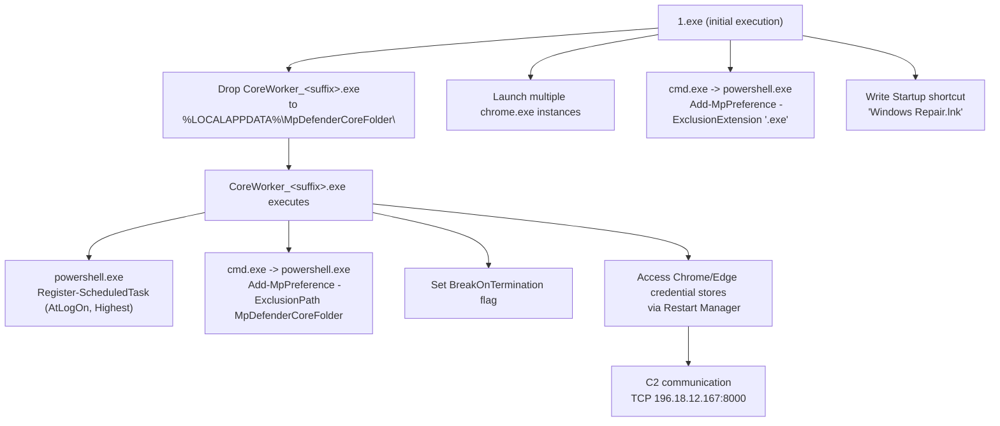
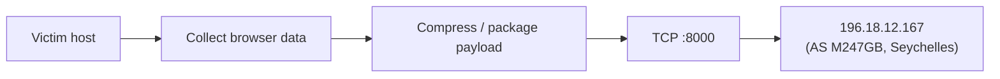

# PureLogs Malware Analysis

> Technical malware analysis supporting the Operation SilentCookie DFIR
> investigation. This document focuses exclusively on the sample's
> capabilities, execution behavior, and indicators of compromise.

## Table of Contents

- [Analysis Scope](#analysis-scope)
- [Sample Overview](#sample-overview)
- [Classification](#classification)
- [Execution Flow](#execution-flow)
- [Persistence Mechanisms](#persistence-mechanisms)
- [Defense Evasion](#defense-evasion)
- [Anti-Analysis / Anti-Sandbox Techniques](#anti-analysis--anti-sandbox-techniques)
- [Credential and Browser Data Theft](#credential-and-browser-data-theft)
- [Command and Control (C2)](#command-and-control-c2)
- [MITRE ATT&CK Mapping](#mitre-attck-mapping)
- [Indicators of Compromise (IOCs)](#indicators-of-compromise-iocs)
- [Detection Opportunities](#detection-opportunities)
- [Conclusion](#conclusion)
- [Source](#source)

---

## Analysis Scope

The malware sample analyzed in this document was obtained from a publicly
available Joe Sandbox analysis rather than recovered directly from the
compromised system investigated in Operation SilentCookie. The purpose of
this analysis is to compare the sample's observed behavior with the
forensic artifacts collected during the incident response. Where
applicable, this report explicitly distinguishes between behavior directly
observed in the sandbox and conclusions drawn through forensic correlation.

## Sample Overview

The analyzed sample was submitted to Joe Sandbox as **1.exe**. Dynamic
analysis showed that the executable behaves as a first-stage dropper
responsible for unpacking and launching the CoreWorker payload while
simultaneously establishing multiple persistence mechanisms and weakening
Windows Defender.

| Property | Value |
|---|---|
| Submitted file name | `1.exe` |
| Dropped payload | `CoreWorker_IwVZUvEqmTYQRhE.exe` |
| Original internal file name (PE metadata) | `Self-Inject2.exe` |
| MD5 (1.exe) | `7DE220D7296166FBB91E889FBFE0737B` |
| SHA1 (1.exe) | `619d7e703f2178cf1794dac78c1da8aa3b1353cb` |
| SHA256 (1.exe) | `79906bf915f0223acf95bbf4cca86df0dcf9f128663ad34ed0bda82e5f40d42e` |
| MD5 (dropped CoreWorker binary) | `ED820B5D8332FFCF05471D191FF68D7B` |
| File size | ~5.3 MB (unusually large for this malware class, likely due to packing) |
| Packer / protector indicators | Section named `.themida`; entry point outside standard sections, in `.boot` |
| Digital signature | Not signed |
| Sandbox | Joe Sandbox Cloud, Analysis ID **1891885** |
| Detection score | 100 / 100 (malicious) |
| Classification | `mal100.troj.spyw.evad.winEXE` — Trojan / Spyware / Evasive |

The submitted sample is a packed, .NET-based dropper. Static analysis flagged
it as containing sections with non-standard/special characters and a section
named `.themida`, consistent with the use of a commercial packer/protector to
hinder static analysis and signature-based detection.

## Classification

PureLogs is a .NET-based information stealer focused on browser credential
theft. The malware combines commodity packing techniques with multiple
persistence mechanisms and defense-evasion features to remain active after
reboot while minimizing static detection.

According to the sandbox report, the sample belongs to the **PureLogs**
information-stealer family. Network signatures specifically matched
**"PureLogs Backdoor Client GZIP C2 Traffic"**, and antivirus engines flagged
it with generic trojan/spyware labels (e.g. `TR/Crypt.XPACK.Gen`), which is
consistent with a packed stealer rather than a uniquely fingerprinted
signature.

Multi-scanner detection at the time of analysis was comparatively low:

- ReversingLabs: 27%
- VirusTotal: 23%
- Avira: detected (generic)
- Joe Sandbox ML: 100% (behavioral detection)

This gap between low static AV detection and a maximum behavioral detection
score illustrates why the sample was able to run undetected during the
original incident — traditional signature-based AV had limited visibility
into the packed binary, while behavior-based detection immediately flagged it.

## Execution Flow

Process tree observed during detonation:

```
1.exe (PID 8120)
├── chrome.exe (x6 instances)
├── cmd.exe → powershell.exe -C "Add-MpPreference -ExclusionExtension '.exe' -EA 0"
└── CoreWorker_IwVZUvEqmTYQRhE.exe (PID 2136)
    ├── powershell.exe -ExecutionPolicy Bypass -Command "New-ScheduledTaskAction ... Register-ScheduledTask ..."
    │   └── WmiPrvSE.exe
    ├── cmd.exe → powershell.exe -Command "Add-MpPreference -ExclusionPath '...MpDefenderCoreFolder'"
    └── CoreWorker_IwVZUvEqmTYQRhE.exe (additional re-spawned instances, PIDs 1236/6440/6936/7032/6888)
```

High-level behavior:

1. `1.exe` is executed from the user's Desktop directory.
2. It immediately drops `CoreWorker_IwVZUvEqmTYQRhE.exe` into
   `%LOCALAPPDATA%\MpDefenderCoreFolder\`.
3. It launches several Google Chrome instances, consistent with automated
   credential/session harvesting rather than normal user browsing.
4. It writes a shortcut (`Windows Repair.lnk`) into the Startup folder,
   pointing back at the dropped CoreWorker binary via a relative path.
5. The dropped `CoreWorker_IwVZUvEqmTYQRhE.exe` re-executes multiple times and
   spawns PowerShell to register persistence and disable AV protections (see
   below).

This behavior closely mirrors the DFIR investigation's forensic timeline: the naming
pattern (`CoreWorker_<random_suffix>.exe`), the AppData execution path, and
the scheduled task name format observed on the compromised host are
consistent with this publicly available sample sharing the same malware
family.



## Persistence Mechanisms

The sample establishes **redundant, overlapping persistence**, which explains
why removing the scheduled task alone did not stop reinfection during
remediation:

1. **Scheduled Task** — created via PowerShell:
   ```powershell
   $action = New-ScheduledTaskAction -Execute 'C:\Users\user\AppData\Local\MpDefenderCoreFolder\CoreWorker_<suffix>.exe'
   $trigger = New-ScheduledTaskTrigger -AtLogOn
   Register-ScheduledTask -Action $action -Trigger $trigger -TaskName 'CoreWorker_<suffix>-<id>' -RunLevel Highest
   ```
   Runs at user logon with the highest available privileges.

2. **Registry Run Keys** — the malware writes autorun entries in both the
   per-user and machine-wide Run keys:
   - `HKCU\Software\Microsoft\Windows\CurrentVersion\Run`
   - `HKLM\Software\Microsoft\Windows\CurrentVersion\Run`

   Both point to the same `CoreWorker_<suffix>.exe` path.

3. **Startup Folder Shortcut** — a `.lnk` file named `Windows Repair.lnk` is
   dropped into:
   ```
   %APPDATA%\Microsoft\Windows\Start Menu\Programs\Startup\
   ```
   using a relative path back to the CoreWorker executable, disguised under a
   benign-sounding name.

This triple redundancy (Scheduled Task + HKCU Run + HKLM Run + Startup
shortcut) provides a plausible technical explanation for the "Persistence Survived Task
Removal" finding in the incident report: deleting only the scheduled task
left the registry Run keys and Startup shortcut intact, which simply
recreated the task on the next logon. This layered persistence strategy
increases resilience against partial remediation attempts.

## Defense Evasion

The sample actively weakens Windows Defender before establishing full
persistence:

- **Defender exclusions added via PowerShell**

  Invoked through `cmd.exe`:
  ```
  Add-MpPreference -ExclusionExtension '.exe' -EA 0
  Add-MpPreference -ExclusionPath 'C:\Users\user\AppData\Local\MpDefenderCoreFolder'
  ```
  This whitelists both the malware's staging folder and the `.exe` extension
  system-wide, allowing the dropped binary and any future payloads dropped
  into that folder to bypass Defender scanning entirely.

- **PowerShell execution policy bypass**

  Uses `-ExecutionPolicy Bypass` and `-NoProfile` to run the scheduled-task
  registration script without triggering policy restrictions.

- **`BreakOnTermination` process protection flag**

  Joe Sandbox directly recorded this flag being set on a CoreWorker process
  during detonation (`Process information set: 01 00 00 00`, tagged as
  "Protects its processes via BreakOnTermination flag"). Enabling this flag
  registers the process as protected with Windows; terminating a process
  configured this way causes Windows to bugcheck rather than exit normally.
  This directly observed behavior is consistent with — and strongly suggests
  the same root cause as — the `CRITICAL_PROCESS_DIED (0xEF)` crashes
  documented in the DFIR investigation, though the specific binary on the
  compromised host was not independently re-verified with a debugger.

- **Direct/indirect syscalls**

  Used to bypass EDR hooks placed in user-mode API calls.

- **Hides threads from debuggers**

  Sets the `HideFromDebugger` thread information flag.

- **Code obfuscation**

  Uses `push`/`ret` instruction patterns instead of direct `call`
  instructions to obscure control flow from static disassembly.

- **Packed sections with high entropy**

  Entropy values of ~7.96–7.99 indicate encrypted or compressed code,
  consistent with a commercial packer/protector.

## Anti-Analysis / Anti-Sandbox Techniques

The sample performs extensive environment checks before fully executing its
payload, a common technique to avoid detonating inside sandboxes or analyst
VMs:

- Queries `Win32_VideoController`, `Win32_ComputerSystem`, and
  `Win32_Processor` via WMI to fingerprint virtualized hardware.
- Queries firmware table information (`FirmwareTableInformation`) to detect
  VM firmware signatures.
- Checks the registry for VirtualBox-specific artifacts
  (`HKLM\HARDWARE\ACPI\DSDT\VBOX__`).
- Searches for analysis-tool window classes: `RegmonClass`, `FilemonClass`,
  `PROCMON_WINDOW_CLASS`.
- Detects the Sandboxie DLL (`SBIEDLL.DLL`) by module name.
- Contains long sleep calls (3+ minutes) intended to outlast automated
  sandbox timeouts; the sandbox's API interceptor recorded 60–80+ modified
  `Sleep()` calls across the dropper, PowerShell, and CoreWorker processes to
  counter this evasion during analysis.
- Checks whether its own process is being debugged.

## Credential and Browser Data Theft

The sample's core objective is harvesting browser-stored credentials and
session data.

Targeted browser data (per this sample's behavior and the PureLogs family
profile referenced in the main investigation report):

| Browser | Target |
|---|---|
| Chrome | Login Data (saved passwords) |
| Chrome | Cookies (`Network\Cookies`) |
| Chrome | Autofill data |
| Edge | Cookies (`Network\Cookies`) |
| Edge | Login Data (saved passwords) |
| Firefox | Saved credentials and cookies |

Behavior directly observed in the sandbox:

- Directly accesses browser credential stores, including:
  - `...\Google\Chrome\User Data\Default\Network\Cookies`
  - `...\Google\Chrome\User Data\Default\Login Data`
  - `...\Microsoft\Edge\User Data\Default\Network\Cookies`
- Uses the **Windows Restart Manager API** to force-unlock these files while
  Chrome/Edge are running, since browsers normally hold an exclusive lock on
  their credential databases during active use.
- Spawns multiple Chrome instances automatically, likely to force credential
  databases into an accessible state or to load stored sessions for
  extraction.
- Creates a hidden window with clipboard-capturing capability
  (`CLIPBRDWNDCLASS`), indicating clipboard-monitoring functionality
  (commonly used to intercept copied passwords, crypto-wallet addresses, or
  2FA codes).

This lines up with the PureLogs family's documented targeting of Chrome,
Edge, and Firefox passwords, cookies, and autofill data referenced in the
main investigation report.

## Command and Control (C2)

Network traffic analysis identified outbound connections matching known
PureLogs C2 patterns:

| Source | Destination | Port | Protocol | Signature |
|---|---|---|---|---|
| 192.168.2.4:49721 | 196.18.12.167 | 8000 | TCP | ET MALWARE PureLogs Backdoor Client GZIP C2 Traffic |
| 192.168.2.4:49723 | 196.18.12.167 | 8000 | TCP | ET MALWARE PureLogs Backdoor Client GZIP C2 Traffic |
| 192.168.2.4:49727 | 196.18.12.167 | 8000 | TCP | ET MALWARE PureLogs Backdoor Client GZIP C2 Traffic |



The same traffic also matched an ETPRO signature for an MSIL
TrojanDownloader checkin pattern, suggesting shared infrastructure or
network fingerprints with .NET-based downloader families. The C2 IP
(`196.18.12.167`, AS M247GB, Seychelles) was contacted directly over TCP on a
non-standard port (8000) **without a corresponding DNS lookup**, a common
technique to avoid DNS-based detection and blocklists.

A secondary, legitimate-looking connection to `ip-api.com` (IP geolocation
service) was also observed — a common technique stealers use for
victim/environment fingerprinting (public IP, country, ISP) prior to or
alongside C2 checkin.

## MITRE ATT&CK Mapping

The observed behavior maps cleanly to multiple ATT&CK tactics, spanning
execution, persistence, defense evasion, discovery, credential access,
collection, and command and control. The table below summarizes each
mapped technique alongside the specific evidence that supports it.

| Tactic | Technique | Evidence |
|---|---|---|
| Execution | T1059.001 – PowerShell | `-ExecutionPolicy Bypass` PowerShell invocations |
| Persistence | T1053.005 – Scheduled Task | `Register-ScheduledTask` at logon, highest privilege |
| Persistence | T1547.001 – Registry Run Keys / Startup Folder | HKCU/HKLM `Run` keys, `Windows Repair.lnk` in Startup |
| Defense Evasion | T1562.001 – Disable or Modify Tools | `Add-MpPreference` Defender exclusions |
| Defense Evasion | T1027.002 – Software Packing | Themida-style packing, high-entropy sections |
| Defense Evasion | T1622 – Debugger Evasion | `HideFromDebugger`, `BreakOnTermination` |
| Discovery | T1497 – Virtualization/Sandbox Evasion | WMI/firmware/registry VM checks, analysis-tool window detection |
| Credential Access | T1555.003 – Credentials from Web Browsers | Chrome/Edge Login Data & Cookies access via Restart Manager |
| Collection | T1115 – Clipboard Data | `CLIPBRDWNDCLASS` window creation |
| Command and Control | T1071 / T1571 – Non-Standard Port | TCP C2 traffic on port 8000 |
| Impact (observed side effect) | — | `BreakOnTermination` flag causing `CRITICAL_PROCESS_DIED` (0xEF) on process kill |

## Indicators of Compromise (IOCs)

| IOC Type | Value |
|---|---|
| File | `%LOCALAPPDATA%\MpDefenderCoreFolder\CoreWorker_<random_suffix>.exe` |
| File | `%APPDATA%\Microsoft\Windows\Start Menu\Programs\Startup\Windows Repair.lnk` |
| Registry | `HKCU\Software\Microsoft\Windows\CurrentVersion\Run\CoreWorker_<random_suffix>` |
| Registry | `HKLM\Software\Microsoft\Windows\CurrentVersion\Run\CoreWorker_<random_suffix>` |
| Scheduled Task | `CoreWorker_<random_suffix>-<numeric_id>` |
| Network (C2) | `196.18.12.167:8000` (TCP) |
| Network (recon) | `208.95.112.1` (ip-api.com — fingerprinting) |
| Hash (MD5, dropper `1.exe`) | `7DE220D7296166FBB91E889FBFE0737B` |
| Hash (MD5, `CoreWorker_*.exe`) | `ED820B5D8332FFCF05471D191FF68D7B` |
| Hash (SHA256, dropper `1.exe`) | `79906bf915f0223acf95bbf4cca86df0dcf9f128663ad34ed0bda82e5f40d42e` |

## Detection Opportunities

The analyzed sample exposes several behavioral indicators that defenders can
monitor for, independent of file-hash-based detection:

- Unsigned executable launched from `%LOCALAPPDATA%` shortly after a
  Desktop-launched process runs.
- A Scheduled Task whose action points to a binary in a user-writable
  directory (rather than `C:\Windows` or `C:\Program Files`).
- `Add-MpPreference` PowerShell invocations adding Defender path or
  extension exclusions.
- Multiple `chrome.exe` processes spawned immediately after an unrelated
  process executes.
- Browser `Login Data` or `Cookies` files being opened by a process other
  than the browser itself, especially while the browser is running.
- Outbound TCP connections to non-standard ports (e.g. 8000) with no
  corresponding DNS query.
- New values written to both `HKCU` and `HKLM` `CurrentVersion\Run` pointing
  to the same executable.

## Conclusion

The analyzed sample exhibits behavior that closely matches the major
artifacts recovered during the Operation SilentCookie incident response: the
randomized `CoreWorker_*` process name, execution from
`%LOCALAPPDATA%\MpDefenderCoreFolder`, the logon-triggered scheduled task,
and — critically — the `CRITICAL_PROCESS_DIED (0xEF)` crashes, which are
consistent with the malware protecting itself via the `BreakOnTermination`
flag rather than an intentional destructive payload. The malware's redundant
persistence (scheduled task + dual Registry Run keys + Startup shortcut)
also provides a plausible technical explanation for why the first
remediation attempt, which only removed the scheduled task, failed to stop
reinfection. The close correlation between the sandbox behavior and the
forensic artifacts recovered from the compromised system increases
confidence in attributing the incident to the PureLogs malware family, while
noting that this correlation is based on a publicly available sample sharing
the same family and behavioral characteristics — not on direct recovery and
detonation of the exact binary from the compromised host.

## Source

Primary behavioral evidence for this analysis was obtained from the following
public source:

- Joe Sandbox Cloud Report (Analysis ID: 1891885)
  https://www.joesandbox.com/analysis/1891885/0/html

  (Accessed: July 2026)

Supporting artifacts will be added under `evidence/artifacts/malware/` as the project evolves.

---

## Disclaimer

This document is provided for educational, research, and defensive
cybersecurity purposes only. It does not include or distribute any malware
sample, executable, or stolen data. All indicators listed above (hashes,
paths, registry keys, network indicators) are shared solely to support
detection engineering and incident response. See the main
[README](../README.md#disclaimer) for the full repository disclaimer.

## Author

**Aryan Ghasemi**

Computer Science Student — Incident Response, Digital Forensics, Malware
Analysis, Threat Hunting.

Part of the [Operation SilentCookie](../README.md) DFIR investigation.